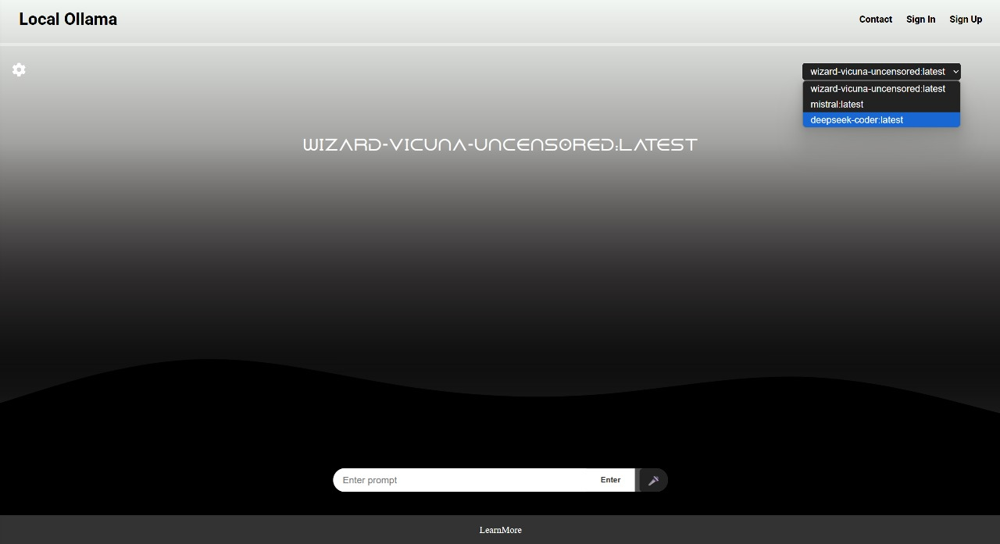

# OllamaReactApp 🚀  

A full-stack application powered by React.js (frontend) and Python (backend), utilizing Ollama for local AI model execution.

# 📂 Project Structure  
OllamaReactApp/
├── frontend/     # React.js frontend
├── backend/      # Python backend
├── .gitignore    # Excluded files
├── README.md     # Project documentation

# 🛠️ Setup Instructions  

## Clone all branches of the repository to respective directories  
```
git clone https://github.com/DhirajSharma89/OllamaReactApp_.git
cd OllamaReactApp_
```

## Frontend Setup (React.js)
### Install Dependencies  
```
cd frontend
npm install
```

## Run the Frontend  
```
npm run dev
```
The frontend runs at: http://localhost:5173

## Backend Setup (Python & Ollama)
Install Dependencies  
Ensure you have Python installed. Then run:
```
cd backend
pip install -r requirements.txt
```

## Run the Backend  
```
python main.py
```
This starts the backend server.


# 🌍 How to Deploy?  
  Set up hosting for frontend (e.g., Vercel, Netlify).  
  Deploy backend on a server (e.g., AWS, Render, Railway).

## Demo Screenshots




---

  

# Contributors
Dhiraj Sharma 🎸 (Lead Developer & Guitarist at ORPHEUS 🤘)  
Hillol Borah

# License  
This project is open-source. Feel free to modify and improve it! 🚀  
